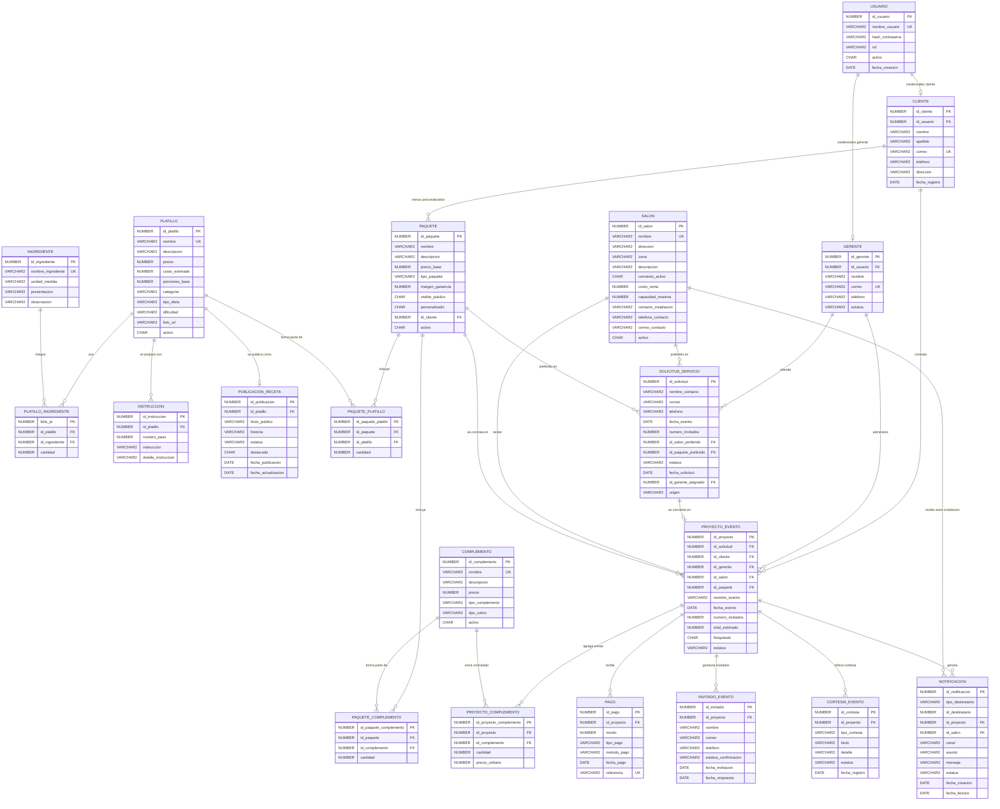

# Diagrama Entidad-Relacion - Catherine: Banquetes Y Recetario

Autores:

- Angel Janvier Gonzalez Delgado
- Carlos Alberto Gutierrez Flores

Este diagrama muestra el modelo entidad-relacion integrado. Banquetes y el recetario comparten `PLATILLO`, `INGREDIENTE`, `PLATILLO_INGREDIENTE` e `INSTRUCCION`; el blog agrega `PUBLICACION_RECETA` para manejar titulo publico, historia, estado y destacado sin duplicar la receta base.

## Reglas Que Refleja El Diagrama

- `SOLICITUD_SERVICIO` y `PROYECTO_EVENTO` estan separados: la solicitud es una peticion inicial y el proyecto nace cuando gerencia confirma el servicio.
- `PLATILLO`, `INGREDIENTE`, `PLATILLO_INGREDIENTE` e `INSTRUCCION` forman la receta tecnica compartida.
- `PUBLICACION_RECETA` convierte un platillo en entrada de blog con titulo publico, historia, estatus y marca de destacado.
- Las cantidades de `PLATILLO_INGREDIENTE.cantidad` son por persona; si el evento tiene 100 invitados, el reporte multiplica por 100.
- `PAQUETE` se arma con platillos existentes y complementos existentes.
- Los paquetes personalizados usan `personalizado = 'S'`, `visible_publico = 'N'` e `id_cliente` obligatorio.
- `PAGO` permite anticipo, abonos y liquidacion; el saldo se calcula contra `total_estimado`.
- `NOTIFICACION` registra avisos para clientes, gerentes, cobranza e instalaciones.
