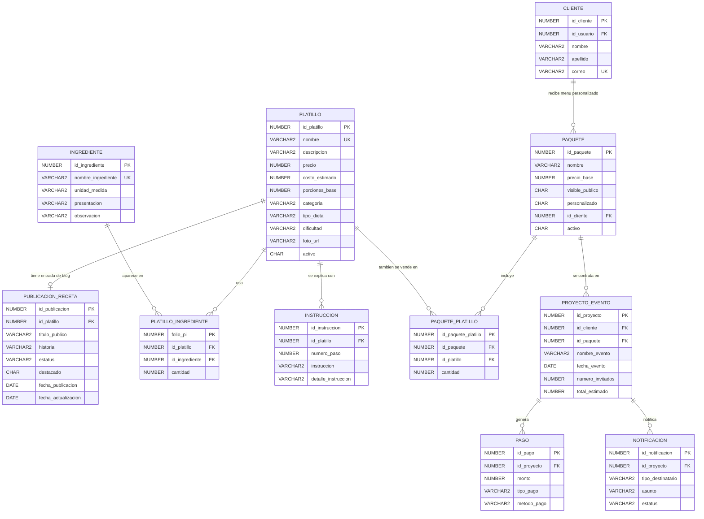

# Diagrama Entidad-Relacion Del Recetario De Catherine

Autor del recetario:

- Angel Janvier Gonzalez Delgado

Este diagrama muestra el recetario como una extension del modelo existente. La receta vive en `PLATILLO`; la entrada de blog vive en `PUBLICACION_RECETA`. Con esto se comparte la misma base entre banquetes y recetario sin duplicar ingredientes ni pasos.

## Reglas Que Satisface

- `PUBLICACION_RECETA.id_platillo` es unico: una receta base tiene como maximo una entrada de blog.
- `PUBLICACION_RECETA.estatus` permite `BORRADOR`, `PUBLICADA` y `ARCHIVADA`.
- `vw_recetario_publico` filtra solo `PUBLICADA`.
- `PLATILLO_INGREDIENTE` evita repetir el mismo ingrediente dentro de la misma receta.
- `INSTRUCCION` ordena el procedimiento por `numero_paso`.
- La misma receta puede aparecer en un paquete de banquetes mediante `PAQUETE_PLATILLO`.
- Los costos y precios siguen disponibles para banquetes, pero el recetario puede capturar recetas sin costo comercial.
